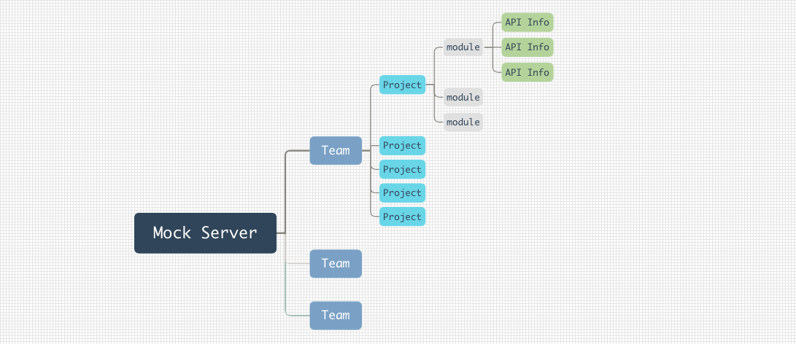
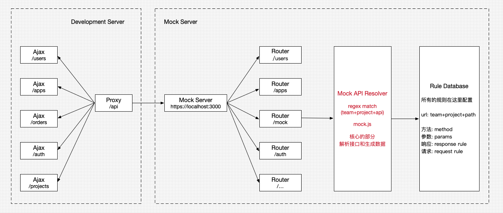

# Mock系统的基本构成

**业务分层：**

常见的Mock系统大概都是下面的分层

主要分为下面的四层：

1. Team（团队、大型的开放系统上层还有企业分支）
2. Project（项目，和我们的项目可能有些不同，说是业务线比较合适）
3. Module（模块，这个更加像是我们所说的项目）
4. API Info（接口，API接口）

**技术架构：**

在设计上，基本都遵从下面的设计：

Mock Server主要是由下面的部分构成：

1. 服务器
2. 基本路由（Mock Server系统使用的路由，用户授权等）
3. mock路由（处理Mock接口url的请求和响应）
4. mock路由解析器（读取接口配置并生成数据，是mock.js最重要的部分）
5. 接口配置存储（存储用户添加的配置）

## URL构成

http://192.168.99.100:38080/app/mock/17/example/1552558351897

URL前缀：http://192.168.99.100:38080/app/mock/17 （这个在项目中一般是固定的）

API路径：/example/1552558351897（这个路径就是写在代码中的，和我们的后端请求的路径是一致的）

